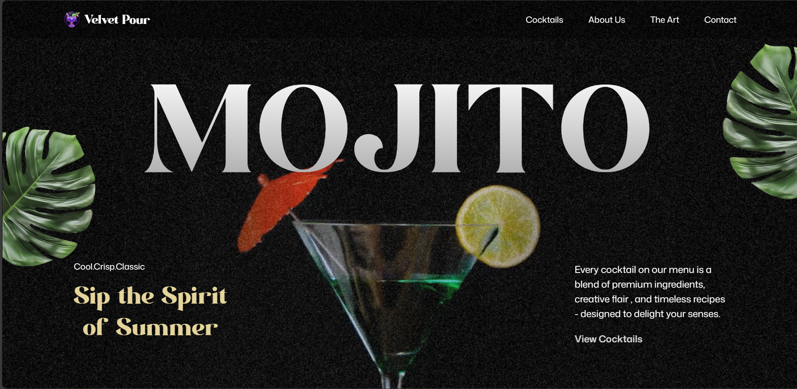

# 🍹 Attractive Mojito Website — React + Vite + GSAP


A **smooth and visually refreshing mojito-themed landing page**, built with **React + Vite**, styled using **Tailwind CSS**, and animated with **GSAP** to deliver a premium, modern UX.

---

## 📌 Table of Contents
- [Demo](#-demo)
- [Features](#-features)
- [Tech Stack](#-tech-stack)
- [How to Run](#-how-to-run-locally)
- [About Project](#-about-project)
- [About Me](#-about-me)
- [Connect with Me](#-connect-with-me)

---

## 🚀 Demo



🔗 **Live Demo:** https://mojito-henna.vercel.app 


---

## ✨ Features
- 🍋 **Modern mojito-themed UI** with premium look  
- 🎞️ **GSAP-powered animations** for smooth transitions  
- ⚡ Built with **React + Vite** for fast performance  
- 🎨 **Tailwind CSS** for a clean, responsive layout  
- 📱 Fully responsive across all screen sizes  
- 🧩 Well-structured and easy-to-extend components  
- 🟢 Lightweight, fast, and visually appealing design  

---

## 🛠️ Tech Stack
- ⚛️ **React.js** — Component-based UI  
- ⚡ **Vite** — Ultra-fast dev environment  
- 🎨 **Tailwind CSS** — Utility-first styling  
- 🌀 **GSAP** — High-performance animations  

---

## 🚦 How to Run Locally

```bash
# Clone the repository
git clone https://github.com/adarshj61/MOJITO.git

# Move into the project folder
cd MOJITO

# Install dependencies
npm install

# Run the app
npm run dev
```

---

## 📖 About Project

This project focuses on creating a **premium landing page experience** inspired by beverage brand design styles.  
GSAP is used extensively for movement, transitions, and scroll-based animations, paired with Tailwind CSS for a clean UI.

It was built to practice:

- Smooth, timeline-based animations  
- Clean React component structure  
- Responsive modern UI  
- Fast development workflow with Vite  

---

## 👨‍💻 About Me
I'm passionate about frontend development and love creating visually appealing UIs.  
This project helped me explore **GSAP animations**, **modern layouts**, and **React + Vite workflows**.

---

## Let's Connect! 🤝

I’m open to collaboration, project ideas, and tech discussions. Reach out here:

<p align="left" style="display: flex; gap: 10px; flex-wrap: wrap;">
  <a href="https://www.linkedin.com/in/adarsh-jaiswal-78a266353" target="_blank" style="text-decoration:none;">
    
  </a>

 <a href="https://github.com/adarshj61" target="_blank">
  
</a>

  <a href="mailto:aj941545@gmail.com" style="text-decoration:none;">
    
  </a>

  <a href="" target="_blank" style="text-decoration:none;">
    
  </a>
</p>

---

